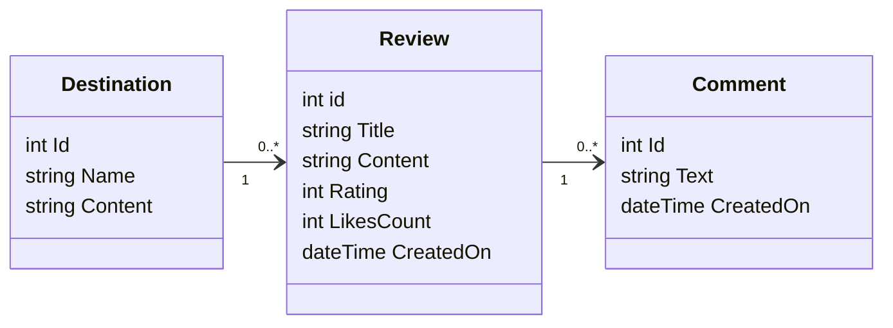

# T120B165 WebApp

## Kelionių forumas

### Sistemos paskirtis:

Skelbimų sistema skirta vartotojams dalintis kelionių savo patirtimis. Šioje sistemoje žmonės galės dalintis savo patirtimis apie įvairias keliones ir suteikti vietovėms įvertinimus. Taip pat bus galima palikti komentarus bei įvertinti kitų vartotojų patirtis.

### Funkciniai reikalavimai
1. **Svečio funkcijos:**
- Peržiūrėti kelionių patirtis ir komentarus

2. **Nario funkcijos:**
- Kurti atsiliepimą apie pasirinktą vietovę ir suteikti jai įvertinimą
- Ištrinti savo atsiliepimą
- Atnaujinti atsiliepimą
- Rašyti komentarus atsiliepimams
- Ištrinti savo komentarą

3. **Administratoriaus funkcijos:**
- Valdyti narių paskyras
- Valdyti atsiliepimus ir komentarus

### Pasirinktų technologijų aprašymas:

1. **Frontend:**
- React.js
2. **Backend**
- Programavimo kalba: C#
- Duomenų bazė: PostgreSQL

### Hierarchiniai ryšiai:
- **Vietovė -> Atsiliepimas**: Viena vietovė gali turėti daug atsiliepimų
- **Atsiliepimas -> Komentaras**: Vienas atsiliepimas gali turėti daug komentarų

### Rolės:
Rolės:
- **Svečias:** Gali peržiūrėti atsiliepimus ir komentarus
- **Narys:** Gali kurti atsiliepimus, komentarus, juos redaguoti/ištrinti bei paspausti patinka ant kitų atsiliepimų
- **Administratorius:** Gali valdyti narius, atsiliepimus, komentarus

